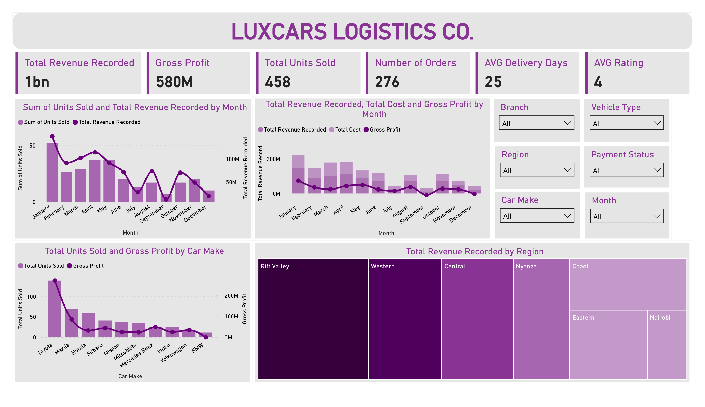

# LuxCars Logistics Co. - Sales & Logistics Dashboard

## Project Overview

The **LuxCars Logistics Co. Dashboard** is an interactive Power BI reporting project developed to transform a deliberately messy vehicle sales and logistics dataset into a decision-ready business intelligence dashboard.

The project covers the complete analytical workflow from **raw-data inspection and cleaning to metric creation, visualization, interactive filtering, and business interpretation**. The final dashboard brings together revenue, profitability, sales volume, orders, delivery performance, customer ratings, vehicle brands, monthly performance, and regional performance in a single view.

The dashboard reports:

- **Total Revenue Recorded:** 1bn
- **Gross Profit:** 580M
- **Total Units Sold:** 458
- **Number of Orders:** 276
- **Average Delivery Days:** 25
- **Average Rating:** 4

The accompanying project report identifies January as the strongest month by revenue and purchases, September as the weakest, Toyota as the strongest-performing brand, BMW as loss-making, and Rift Valley as the largest revenue-generating region.

---

## Dashboard Preview



---

## Business Objective

The primary objective was to convert operational sales data into an interactive management dashboard that can answer questions such as:

1. How much revenue and gross profit has the business generated?
2. How many vehicles have been sold and how many orders have been recorded?
3. Which months generate the highest and lowest revenue?
4. Which car makes contribute the most units and profit?
5. Which regions generate the most revenue?
6. How do revenue, cost, and gross profit change over time?
7. What is the average delivery time and customer rating?
8. Can performance be filtered by branch, region, car make, vehicle type, payment status, and month?

---

# Project Structure

```text
LuxCars/
│
├── LuxCars_dataset.csv          # Raw vehicle sales and logistics dataset
├── LuxCars.pbix                 # Power BI Desktop project
├── dashboard.png                # Dashboard image preview
├── LuxCars_dashboard.pdf        # Exported dashboard
├── LuxCars_report.pdf           # Project report containing insights and recommendations
└── README.md                    # Project documentation
```

---

## Dataset

The raw dataset is stored in:

`LuxCars_dataset.csv`

It contains **276 records and 32 columns**, covering order information, customer attributes, geographic information, sales representatives, vehicle characteristics, sales quantities, pricing, discounts, logistics costs, payment information, delivery information, customer ratings, returns, and recorded revenue.

### Main fields

| Category | Fields |
|---|---|
| Order information | `Order ID`, `Order Date`, `Delivery Date` |
| Customer information | `Customer Name`, `Customer Type`, `Customer Age` |
| Geography | `Region`, `County`, `City`, `Branch` |
| Sales operations | `Sales Rep`, `Lead Source` |
| Vehicle information | `Car Make`, `Car Model`, `Vehicle Type`, `Vehicle Year`, `Fuel Type`, `Transmission`, `Color` |
| Sales and pricing | `Units Sold`, `Unit Selling Price`, `Unit Cost`, `Discount` |
| Logistics | `Delivery Fee`, `Logistics Cost` |
| Payment | `Payment Method`, `Payment Status` |
| Delivery | `Delivery Status` |
| Customer feedback | `Customer Rating`, `Review Count` |
| Returns and revenue | `Returned`, `Revenue Recorded` |

The raw data contains intentional inconsistencies that make it unsuitable for direct aggregation without preprocessing. Examples include mixed date formats, inconsistent capitalization, spelling variations, currency symbols, numeric values stored as text, percentage values represented in multiple ways, placeholder/error values, and inconsistent categorical labels.

---

# Data Cleaning & Preparation

The cleaning stage was essential because the raw dataset contained multiple representations of the same business value. The objective was not simply to remove errors, but to make the fields **consistent, typed correctly, and suitable for aggregation in Power BI**.

## 1. Initial Data Profiling

The dataset was first inspected column-by-column to identify:

- Data types
- Missing values
- Duplicate records
- Invalid values
- Inconsistent categorical labels
- Currency and percentage formatting
- Date-format inconsistencies
- Numerical fields stored as text
- Placeholder values such as `N/A`, `NULL`, `missing`, `TBD`, `error`, `#VALUE!`, `#DATE!`, and `-`

No exact duplicate rows were present in the raw 276-row dataset.

A key finding from the profiling stage was that many columns that should have been numeric or categorical were stored as text. For example, `Units Sold` contains values such as `3`, `3 cars`, `two`, `one`, and `-1`, while monetary fields contain combinations of plain numbers, `KES`, `KSh`, comma-separated values, and values expressed using `M`.

---

## 2. Date Cleaning and Standardization

`Order Date` and `Delivery Date` contained several date representations, including:

- `Aug 29, 2025`
- `2026/01/19`
- `26-Mar-2025`
- `03/20/2026`
- Excel serial-date values such as `46066`
- Invalid values such as `2026-13-04`
- Placeholder/error values such as `not sure` and `#DATE!`

The dates were standardized into a consistent date type so that Power BI could correctly:

- Sort months chronologically
- Group transactions by month
- Calculate delivery duration
- Compare monthly revenue and sales performance

A proper date representation was particularly important for the monthly trend visuals.

---

## 3. Text Cleaning and Standardization

Text fields were normalized to reduce the number of distinct categories created by differences in capitalization, spacing, abbreviations, and spelling.

Examples of inconsistencies found in the raw data include:

- `TOYOTA`, `Toyota`, `toyota`, `Toyta`, `TOYTA`, `totoya`
- `MITSUBISHI`, `Mitsubishi`, `Mitshubishi`
- `NAIROBI`, `Nairobi`, `Nairobii`, `nrb`
- `WESTERN`, `Western`, `western`, `WEST`, `westen`
- `AUTO`, `auto`, `Automatic`, `A/T`, `AT`
- `Manual`, `MANUAL`, `M/T`, `MT`
- `WhatsApp`, `WHATS APP`, `Watsapp`, `whatsapp`
- `M-Pesa`, `M PESA`, `mpesa`, `M pesa`

The cleaning process consolidated these variants into consistent business categories.

This was especially important for dimensions used by dashboard filters and grouping visuals, including:

- Region
- Branch
- Car Make
- Vehicle Type
- Fuel Type
- Transmission
- Payment Method
- Payment Status
- Delivery Status
- Lead Source

---

## 4. Customer Type Standardization

`Customer Type` contained multiple labels representing the same customer segment.

Examples included:

- `Individual`, `individual`, `INDIVIDUAL`, `PERSON`, `Person`
- `Corporate`, `CORPORATE`, `corp`, `CORP`
- `Government`, `GOVERNMENT`, `govt`, `GOVT`, `county govt`
- `NGO`, `Ngo`, `n.g.o`, `N.G.O`
- `Dealer`, `dealer`, `DEALER`, `car dealer`, `CAR DEALER`

These variants were standardized into a smaller set of meaningful business categories so that customer segmentation would not be fragmented by inconsistent source entry.

---

## 5. Vehicle Brand and Category Cleaning

Vehicle-related fields were standardized before being used for analysis.

### Car Make

The raw data contained spelling and formatting variants such as:

- Toyota / Toyta / TOYTA / totya / Toyota Kenya
- Mitsubishi / Mitshubishi
- Subaru / SUBRU / subaru
- Mercedes / Mercedes-Benz / Mercedes Benz
- Volkswagen / V.W / VOLKS WAGEN
- BMW / B.M.W / bmw

These were mapped to consistent manufacturer names.

### Vehicle Type

Vehicle types were normalized across case and formatting differences, including:

- SUV / suv / Suv
- Sedan / saloon
- Wagon / WAGON
- Pickup / PICKUP
- Crossover / CROSSOVER
- Hatchback / HATCHBACK
- Van / VAN
- Truck / TRUCK

Placeholder values such as `-` were treated as missing/invalid categorical values rather than as a genuine vehicle category.

---

## 6. Numeric Cleaning

Several numerical fields were stored as text and required conversion before aggregation.

### Units Sold

`Units Sold` included:

- Standard numbers such as `1`, `2`, `3`
- Text descriptions such as `one` and `two`
- Compound values such as `3 cars`
- Invalid negative values
- Missing values

The values were standardized to numeric quantities so that total units could be aggregated reliably.

### Customer Rating

`Customer Rating` contained values such as:

- `4.5 out of 5`
- `3.8 out of 5`
- `4.6`
- `5`
- `Excellent`
- `-`

The rating field was converted into a numeric representation suitable for calculating the average customer rating. Invalid placeholders were treated as missing values.

### Review Count

`Review Count` was also normalized to a numeric field. Non-numeric placeholders were handled as missing values.

---

## 7. Currency and Monetary Field Cleaning

The following fields required monetary normalization:

- `Unit Selling Price`
- `Unit Cost`
- `Delivery Fee`
- `Logistics Cost`
- `Revenue Recorded`

The raw data contains multiple representations of the Kenyan shilling, including:

- `KES`
- `KSh`
- Plain numeric values
- Comma-separated amounts
- Values expressed in millions, such as `9.14M`
- Negative values
- Invalid placeholders such as `error` and `#VALUE!`

The cleaning process removed presentation-level currency characters and converted the underlying values to numeric fields.

For example:

`KSh 8,136,000` → `8136000`

`9.14M` → `9140000`

This ensured that monetary measures could be summed and compared consistently.

---

## 8. Discount Cleaning

`Discount` was represented using several formats, including:

- `7 %`
- `10%`
- `0.07`
- `ten percent`
- `5 percent`
- `15 %`
- `0.15`
- `120%`
- `-10`
- Placeholder values such as `unknown`

The values were standardized into a consistent percentage/decimal representation before being used in calculations.

Out-of-range and invalid discount entries were treated as data-quality issues rather than legitimate business percentages.

---

## 9. Missing and Invalid Values

The dataset contained missing values and explicit error markers across multiple columns.

Examples include:

- Blank values
- `N/A`
- `NULL`
- `missing`
- `TBD`
- `error`
- `#VALUE!`
- `#DATE!`
- `not sure`
- `-`

The treatment depended on the field:

- **Numeric fields:** converted to numeric types and invalid entries handled as missing values where appropriate.
- **Dates:** invalid dates were excluded from date calculations or treated as missing.
- **Categorical fields:** invalid placeholders were treated as missing rather than being interpreted as actual categories.
- **Analytical fields:** missing values were handled in a way that prevented invalid records from distorting aggregated measures.

The objective was to preserve as much usable information as possible without allowing obvious data-entry errors to become legitimate business categories or numeric values.

---

## 10. Validation After Cleaning

After transformation, the data was checked to confirm that:

- Required analytical columns had appropriate data types.
- Dates could be used for chronological analysis.
- Currency fields could be aggregated.
- Units sold could be summed.
- Categorical dimensions had consistent labels.
- Invalid placeholders were not treated as genuine categories.
- Measures returned sensible values.
- Monthly and regional aggregations reconciled with the dashboard totals.

The final Power BI model uses the cleaned `staging jcars` table as the analytical source for the dashboard visuals.

---

# Measures & Business Calculations

The dashboard uses measures to convert cleaned transactional data into business-level KPIs.

## Total Cost

Total cost is calculated as the sum of the `Unit Cost` field.

```DAX
Total Cost =
SUM('staging jcars'[Unit Cost])
```

## Total Revenue Recorded

Total revenue is calculated from the cleaned `Revenue Recorded` field.

```DAX
Total Revenue Recorded =
SUM('staging jcars'[Revenue Recorded])
```

## Total Units Sold

The total number of vehicles sold is calculated by summing `Units Sold`.

```DAX
Total Units Sold =
SUM('staging jcars'[Units Sold])
```

## Gross Profit

Gross profit represents the difference between total revenue and total cost.

```DAX
Gross Profit =
[Total Revenue Recorded] - [Total Cost]
```

## Gross Profit Margin

Gross profit margin expresses gross profit as a proportion of total revenue.

```DAX
Gross Profit Margin =
DIVIDE(
    [Gross Profit],
    [Total Revenue Recorded]
)
```

## Average Delivery Days

Average delivery performance is based on the average number of days between the relevant order and delivery dates.

```DAX
Average Delivery Days =
AVERAGE('staging jcars'[Delivery Days])
```

## Average Rating

Customer satisfaction is represented using the average customer rating.

```DAX
Average Rating =
AVERAGE('staging jcars'[Customer Rating])
```

## Number of Orders

The dashboard also presents the total number of orders represented in the dataset.

```DAX
Number of Orders =
COUNTROWS('staging jcars')
```

> **Note:** The exact DAX implementation may vary depending on the final Power BI model and calculated columns used in the `.pbix` file. The definitions above document the analytical logic represented in the project report.

---

# Visualization & Dashboard Development

The dashboard was designed as a single-page management view, with the most important KPIs positioned at the top and analytical visuals arranged underneath.

## 1. KPI Cards

Six KPI cards provide an immediate snapshot of business performance:

| KPI | Purpose |
|---|---|
| Total Revenue Recorded | Measures overall sales revenue |
| Gross Profit | Measures profitability |
| Total Units Sold | Measures sales volume |
| Number of Orders | Measures transaction volume |
| Average Delivery Days | Measures logistics performance |
| Average Rating | Measures customer satisfaction |

This layout allows a user to understand the overall business position before exploring individual dimensions.

---

## 2. Monthly Units Sold and Revenue

A combination chart compares:

- **Units Sold**
- **Total Revenue Recorded**

by month.

The dual-axis design allows volume and monetary performance to be viewed together despite their different scales.

This visual helps identify:

- High- and low-performing months
- Changes in sales volume
- Revenue fluctuations
- Potential relationships between units sold and revenue

The project report identifies **January as the strongest month and September as the weakest** for revenue and purchases.

---

## 3. Monthly Revenue, Cost and Gross Profit

A second monthly visual compares:

- Total Revenue Recorded
- Total Cost
- Gross Profit

This provides a direct view of the relationship between sales, cost, and profitability over time.

It is useful for identifying months where:

- Revenue is high
- Costs are elevated
- Gross profit expands or contracts
- Profitability does not move proportionally with sales

---

## 4. Car Make Performance

A combination chart compares each car manufacturer by:

- Total Units Sold
- Gross Profit

This visual was selected to distinguish **sales volume from profitability**.

A brand may sell many vehicles without generating the highest profit, while another brand may generate strong margins from lower sales volume.

The project report identifies **Toyota as the strongest-performing brand**, while **BMW is identified as loss-making**.

---

## 5. Regional Revenue Treemap

A treemap displays total revenue by region.

The size of each rectangle represents the relative revenue contribution of that region, making it easy to identify the largest revenue-generating markets.

The dashboard identifies **Rift Valley as the largest revenue earner**.

---

## 6. Interactive Slicers

The dashboard includes interactive filters for:

- Branch
- Region
- Car Make
- Vehicle Type
- Payment Status
- Month

These slicers allow users to move from an overall company view to a more specific operational analysis without requiring separate reports.

For example, a user can filter to a specific region and car make to investigate the revenue contribution of that combination.

---

# Dashboard Design

The visual design uses a consistent purple-and-neutral theme to create a professional corporate appearance.

### Design principles applied

- KPI cards positioned at the top for rapid interpretation
- Consistent typography and spacing
- Clear visual hierarchy
- Combination charts for comparing metrics with different scales
- Treemap for proportional regional comparison
- Slicers grouped together for efficient filtering
- Minimal visual clutter
- Consistent labeling of business metrics
- A single-page layout for executive-level monitoring

The objective was to make the dashboard usable for both **high-level management review and exploratory analysis**.

---

# Key Business Insights

Based on the completed dashboard and project report:

### 1. Overall financial performance

The business recorded approximately **1 billion in revenue and 580 million in gross profit**.

### 2. Monthly performance

**January** records the highest revenue and purchase volume, while **September** records the lowest.

### 3. Brand performance

**Toyota** is the strongest-performing manufacturer in terms of volume and profitability.

**BMW** is identified as loss-making and therefore requires management attention.

### 4. Regional performance

**Rift Valley** is the largest revenue-generating region.

### 5. Customer and logistics performance

The dashboard reports an **average delivery time of 25 days** and an **average customer rating of 4**.

---

# Recommendations

The project report proposes the following business actions:

1. **Strengthen the Japanese-brand portfolio**, with particular emphasis on Toyota given its strong sales and profitability performance.
2. **Review the BMW product line** and investigate the causes of its negative profitability before continuing or expanding the offering.
3. **Increase marketing activity in September**, the weakest month, with particular focus on the **Nairobi, Eastern, and Coast regions**.
4. Continue monitoring delivery performance and customer ratings as operational KPIs alongside revenue and profitability.

---

# Tools & Technologies

- **Microsoft Power BI Desktop** — data transformation, data modeling, DAX measures, visualization, and dashboard development
- **Power Query** — data cleaning and transformation
- **DAX** — KPI and analytical measure creation
- **CSV** — source data format
- **PDF / PNG** — dashboard and reporting outputs

---

# Deliverables

| File | Description |
|---|---|
| `LuxCars_dataset.csv` | Raw source dataset |
| `LuxCars.pbix` | Editable Power BI dashboard and data model |
| `dashboard.png` | Dashboard preview image |
| `LuxCars_dashboard.pdf` | PDF export of the dashboard |
| `LuxCars_report.pdf` | Analytical report with insights and recommendations |
| `README.md` | Project documentation |

---

# Conclusion

The LuxCars Logistics Co. project demonstrates how a raw operational dataset containing inconsistent, mixed-format, and partially incomplete data can be transformed into a structured business intelligence solution.

The workflow combines **data quality management, transformation, analytical measure development, and visualization** to produce a dashboard that makes revenue, profitability, sales volume, regional performance, vehicle-brand performance, logistics, and customer satisfaction easier to monitor.

The final dashboard moves the analysis from raw transactional records to a concise management view that supports **performance monitoring, product decisions, regional targeting, and marketing planning**.

---

# Author

**Shaquille Mburu**

Data Analyst | Data Engineer | Machine Learning Enthusiast

---